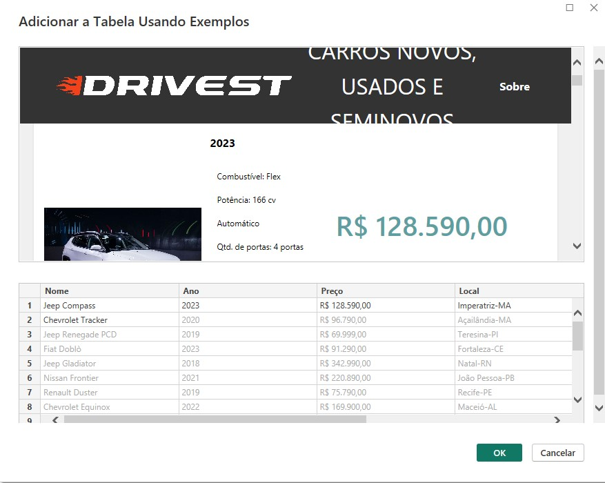

### Web Scrapping com o Power BI

 Realizado o Web Scrapping de Dados de uma pagina Web, via microsoft Power BI.

 Projeto realizado através da plataforma alura, mais especificamente no "Alura +: Power BI: Web Scraping e tratamento de dados", ministrado por Marcus Almeida.

 <strong> Nota: </strong> Para não estáticos, pode ocorrer que esse processo possa não atender a necessidade.

 <strong> URL de extração: </strong> https://labdados.com/A+/drivest 

#### Passo a Passo

 Clique em "Obter Dados" -> busque por "Web" -> insira a url (https://labdados.com/A+/drivest)

 Selecione a opção "Adicionar a Tabela Usando Exemplos" 

 Adicione manualmente, o nome das colunas e insira os dados manualmente, referente a coluna. Inserindo manualmente dois valores, haverá um preenchimento automatico. 

 Em seguida basta clicar na tabela criada e clicar em "Transformar Dados" e seguir normalmente a criação do Dashboard 

